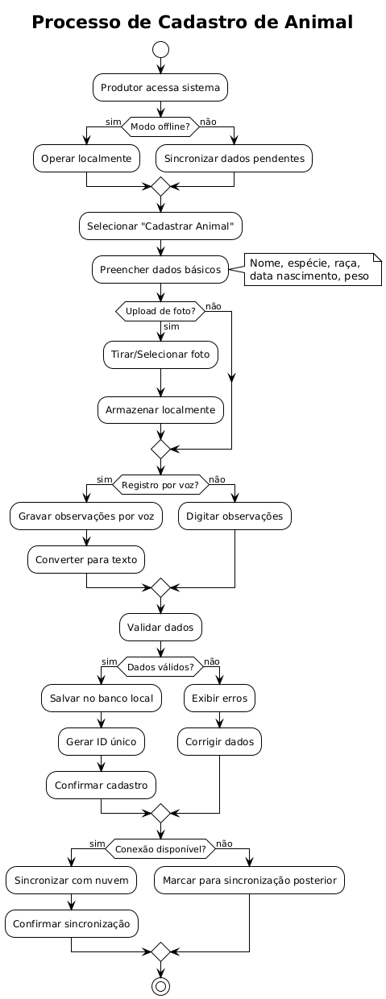
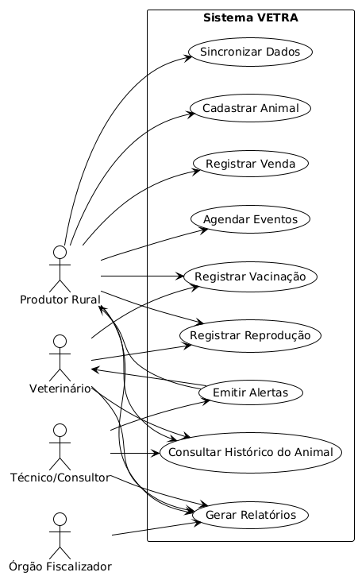

# 🐮 VETRA — Sistema de Gestão Pecuária Digital

## 2.1 Imersão & Empatia

### 🎯 Objetivo
Compreender os desafios enfrentados por produtores rurais, veterinários e agroindústrias na **gestão de dados de animais**, identificando dores, barreiras culturais e oportunidades de digitalização no campo.

---

### 👥 Stakeholders

| Tipo | Descrição |
|------|------------|
| **Cliente** | Pequenos e médios produtores rurais, veterinários e agroindústrias. |
| **Usuário** | Produtores que controlam informações sobre os animais e precisam de registros organizados e acessíveis. |
| **Gestores** | Responsáveis pela administração da fazenda e cumprimento de normas legais. |
| **Técnicos** | Equipe de desenvolvimento e suporte do sistema, consultores e veterinários que alimentam ou validam dados. |

---

### 💬 Necessidades, Dores e Expectativas

- **Necessidades:** Simplificar e centralizar o controle de dados de criação animal.  
- **Dores:** Registros manuais (cadernos, planilhas soltas), perda de informações, desorganização, multas por falta de documentação.  
- **Expectativas:** Sistema digital simples, confiável e acessível mesmo em áreas com baixa conectividade.

---

### 🧠 Matriz CSD (Certezas, Suposições, Dúvidas)

| **Certezas** | **Suposições** | **Dúvidas** |
|---------------|----------------|-------------|
| A gestão de dados dos animais é feita de forma manual e descentralizada. | Produtores confiam mais em soluções simples e de fácil uso. | O produtor rural está disposto a investir em tecnologia digital? |
| Há resistência cultural à digitalização. | O acesso offline é essencial para adesão. | Como garantir adoção contínua por produtores mais velhos? |
| Falta de digitalização prejudica a rastreabilidade e o controle sanitário. | Centralizar dados aumenta segurança e transparência. | Quais diferenciais tornarão o VETRA competitivo frente a outras soluções? |

---

### 🌍 Fatores Externos

| Tipo | Descrição |
|------|------------|
| **Sociais** | Cultura de registros manuais e baixa familiaridade com tecnologia. |
| **Tecnológicos** | Falta de digitalização e infraestrutura limitada nas áreas rurais. |
| **Econômicos** | Custos altos e escassez de recursos para investir em novas ferramentas. |
| **Políticos** | Regulamentações exigem rastreabilidade e conformidade legal. |
| **Legais** | Normas de controle animal e fiscalização sanitária obrigatórias. |

---

### 🗣️ Entrevistas e Observações
**Principais percepções obtidas:**
- Produtores usam cadernos e planilhas improvisadas para controle.  
- Há medo de perder informações importantes ou sofrer penalidades legais.  
- Resistência cultural é um obstáculo, mas há reconhecimento da importância da organização.  
- A digitalização é vista como oportunidade de transparência e modernização.  

---

## 2.2 Definição & Síntese

### 👤 Personas

**Murilo — 45 anos, Pecuarista (Zona Rural de SC)**  
- **Perfil:** Tradicional e resistente à tecnologia.  
- **Dores:** Perde informações com frequência e sente insegurança em sistemas digitais.  
- **Necessidade:** Uma solução confiável, simples e fácil de usar.  
- **Frase:** “Prefiro registrar no papel, mas sei que às vezes perco informação.”

**Marlon — 37 anos, Técnico em Pecuária**  
- **Perfil:** Familiarizado com tecnologia, presta consultoria para produtores.  
- **Dores:** Enfrenta resistência dos pecuaristas e falta de padronização nos dados.  
- **Necessidade:** Ferramentas que engajem produtores e facilitem acompanhamento técnico.  
- **Frase:** “Preciso de uma plataforma que organize tudo e facilite o trabalho dos criadores.”

---

### 🧩 Agrupamento de Informações

| Grupo | Características |
|--------|-----------------|
| **Tradicionalistas (Murilo + Alexandre)** | Resistentes ao digital, preferem papel/caderno, buscam confiança e simplicidade. |
| **Jovens Produtores (Eduardo + Isabel + Alana + Leonardo)** | Usam Excel, abertos à tecnologia, querem reduzir retrabalho e automatizar tarefas. |
| **Técnicos/Consultores (Marlon)** | Valorizam digitalização, enfrentam resistência cultural e buscam padronização de dados. |

---

### 💡 Insights

1. Mesmo resistentes à tecnologia, produtores reconhecem a importância da organização e precisam de **confiança, simplicidade e segurança** para adotar soluções digitais.  
2. Produtores mais jovens estão abertos ao digital, mas sentem-se **sobrecarregados** por tarefas manuais — desejam **automação e integração**.  
3. Técnicos e consultores reconhecem o valor da digitalização, mas precisam de **ferramentas que engajem produtores e facilitem acompanhamento e padronização** dos dados.

---

### ❓ Problema Central

> **Como podemos transformar o controle burocrático da criação de animais em uma gestão digital simples, confiável e acessível, aumentando a eficiência e a rastreabilidade no campo?**

---

### 📋 Requisitos Prioritários

| Tipo | Requisito |
|------|------------|
| **Funcionais** | Cadastro de animais e histórico completo (nascimento à venda); relatórios de desempenho; controle sanitário; integração com órgãos fiscalizadores. |
| **Não Funcionais** | Interface simples e intuitiva; operação offline; segurança de dados; compatibilidade com dispositivos móveis. |

---

## 2.3 Ideação

### 🧠 Brainstorming de Ideias

1. **Banco Local + Nuvem:** sistema híbrido que funciona offline e sincroniza dados automaticamente.  
2. **Painel do Criador:** centraliza todas as informações do rebanho em um só lugar.  
3. **Relatórios Inteligentes:** métricas de produtividade, custos e comparativos de desempenho.  
4. **Calendário de Eventos:** agendamento de vacinas, partos e vendas.  
5. **Módulo de Conformidade Legal:** alertas sobre documentos e exigências sanitárias.  
6. **Aplicativo Mobile:** acesso rápido e intuitivo, mesmo para usuários de pouca familiaridade digital.  

---

### ⭐ Avaliação de Ideias

| Ideia | Impacto | Viabilidade | Inovação | Total |
|-------|----------|-------------|-----------|--------|
| Banco Local + Nuvem | 5 | 5 | 4 | **14** |
| Painel do Criador | 5 | 4 | 4 | **13** |
| Relatórios Inteligentes | 4 | 4 | 4 | **12** |
| Calendário de Eventos | 4 | 5 | 3 | **12** |
| Aplicativo Mobile | 5 | 5 | 4 | **14** |

---

### 🏁 Ideias Finalistas para Prototipação

- **Banco Local + Nuvem:** garante acessibilidade mesmo sem internet e sincroniza dados com segurança.  
- **Painel do Criador:** centraliza e organiza as informações de forma visual e intuitiva.  
- **Aplicativo Mobile:** interface simples para uso diário, com suporte a múltiplas idades.  

---

## 2.4 Prototipação

### 🎯 Objetivo
Validar as ideias por meio de representações visuais, simulando o uso real do sistema para garantir que a solução proposta atenda às necessidades identificadas.

---

### 🧱 Modelos Conceituais

#### 📘 Casos de Uso Principais
- Cadastrar Animal  
- Registrar Vacinação e Reprodução  
- Consultar Histórico do Animal  
- Gerar Relatórios de Desempenho  
- Sincronizar Dados (Offline/Online)  
- Notificar Eventos Importantes  

---

### 🖼️ Protótipo de Interface (Wireframe de Alta Fidelidade)

**Descrição:**  
O protótipo apresenta a interface principal do aplicativo **VETRA**, destacando:
- Visualização detalhada da ficha de cada animal (foto, peso, raça, vacinas e reprodução).  
- Funcionalidades de **anotação, registro por voz e imagem**, facilitando o uso em campo.  
- Área de **ações automáticas** que alerta o produtor sobre eventos futuros, como partos e vacinas.  
- Design simples, intuitivo e funcional, pensado para operação mesmo em ambientes rurais.  

---

### 🧮 Modelo Lógico Simplificado

**Tabelas principais:**  
- `PRODUTOR(id_produtor, nome, cpf, telefone, endereco)`  
- `ANIMAL(id_animal, id_produtor, nome, especie, nascimento, peso_atual, status)`  
- `EVENTO_SANITARIO(id_evento, id_animal, tipo_evento, data_evento, observacoes)`  
- `SINCRONIZACAO(id_sync, id_produtor, data_sync, status)`  

💾 *Estrutura híbrida (local + nuvem) que assegura acesso contínuo e segurança dos dados.*

---

### 🚀 MVP Inicial

**Funcionalidades:**
- Cadastro e histórico de animais  
- Registro de eventos (vacinas, partos, vendas)  
- Sincronização automática  
- Alertas e notificações inteligentes  

**Próximos passos:**
1. Testes pilotos em fazendas parceiras.  
2. Validação com técnicos e produtores.  
3. Ajustes de interface e relatórios.  
4. Planejamento de integração com órgãos fiscalizadores.  

---

## 📘 Requisitos Funcionais (RF)

| Código | Descrição |
|:-------|:-----------|
| **RF01 - Gestão de Produtores** |  |
| RF01.01 | Cadastrar produtor rural |
| RF01.02 | Editar dados do produtor |
| RF01.03 | Inativar produtor |
| **RF02 - Gestão de Animais** |  |
| RF02.01 | Cadastrar animal com dados completos |
| RF02.02 | Editar informações do animal |
| RF02.03 | Consultar ficha completa do animal |
| RF02.04 | Upload de fotos do animal |
| RF02.05 | Registro por voz de observações |
| RF02.06 | Inativar/baixar animal (venda, morte) |
| **RF03 - Controle Sanitário** |  |
| RF03.01 | Registrar vacinação |
| RF03.02 | Registrar tratamentos médicos |
| RF03.03 | Registrar doenças |
| RF03.04 | Consultar histórico sanitário |
| RF03.05 | Agendar próximas vacinas |
| **RF04 - Controle Reprodutivo** |  |
| RF04.01 | Registrar cobertura/monta |
| RF04.02 | Registrar diagnóstico de gestação |
| RF04.03 | Registrar parto |
| RF04.04 | Registrar nascimento de bezerros |
| RF04.05 | Consultar histórico reprodutivo |
| **RF05 - Gestão de Vendas** |  |
| RF05.01 | Registrar venda de animal |
| RF05.02 | Gerar comprovante de venda |
| RF05.03 | Consultar histórico de vendas |
| **RF06 - Relatórios e Análises** |  |
| RF06.01 | Gerar relatório de produção |
| RF06.02 | Gerar relatório sanitário |
| RF06.03 | Gerar relatório reprodutivo |
| RF06.04 | Exportar relatórios em PDF |
| RF06.05 | Comparar métricas com benchmarks |
| **RF07 - Sincronização de Dados** |  |
| RF07.01 | Operar em modo offline |
| RF07.02 | Sincronizar dados com nuvem |
| RF07.03 | Resolver conflitos de sincronização |
| RF07.04 | Backup automático de dados |
| **RF08 - Alertas e Notificações** |  |
| RF08.01 | Alertas de vacinas pendentes |
| RF08.02 | Notificações de partos previstos |
| RF08.03 | Lembretes de eventos programados |
| **RF09 - Integração com Órgãos** |  |
| RF09.01 | Emitir certificados sanitários |
| RF09.02 | Exportar dados para fiscalização |
| RF09.03 | Integração com sistemas governamentais |

---

## ⚙️ Requisitos Não Funcionais (RNF)

| Código | Descrição |
|:-------|:-----------|
| **RNF01 - Usabilidade** |  |
| RNF01.01 | Interface intuitiva para usuários com baixa familiaridade digital |
| RNF01.02 | Tempo de aprendizado menor que 30 minutos |
| RNF01.03 | Navegação com no máximo 3 cliques para funções principais |
| **RNF02 - Desempenho** |  |
| RNF02.01 | Tempo de resposta inferior a 2 segundos |
| RNF02.02 | Suporte a até 10.000 animais por produtor |
| RNF02.03 | Sincronização em background sem impactar uso |
| **RNF03 - Confiabilidade** |  |
| RNF03.01 | Disponibilidade de 99% (considerando modo offline) |
| RNF03.02 | Backup automático a cada 24h |
| RNF03.03 | Recuperação de dados em caso de falha |
| **RNF04 - Segurança** |  |
| RNF04.01 | Autenticação do usuário |
| RNF04.02 | Criptografia de dados sensíveis |
| RNF04.03 | Controle de acesso por perfil |
| **RNF05 - Compatibilidade** |  |
| RNF05.01 | Funcionamento em Android e iOS |
| RNF05.02 | Compatibilidade com versões antigas de SO |
| RNF05.03 | Funcionamento em tablets e smartphones |
| **RNF06 - Conectividade** |  |
| RNF06.01 | Operação 100% offline |
| RNF06.02 | Sincronização com pouca conectividade |
| RNF06.03 | Consumo mínimo de dados |

---

## 👤 Histórias de Usuário

| Épico | História | Como... | Quero... | Para... | Critérios de Aceite |
|:------|:----------|:--------|:---------|:---------|:--------------------|
| **Gestão de Animais** | HU01 | Produtor rural | Cadastrar um novo animal com foto e dados básicos | Ter controle completo do meu rebanho | - Funcionar offline - Upload de foto - ID único automático - Validação de dados |
|  | HU02 | Produtor | Consultar ficha completa de um animal | Tomar decisões sobre manejo e vendas | - Mostrar histórico completo - Incluir fotos e observações - Carregar em menos de 3 segundos |
| **Controle Sanitário** | HU03 | Veterinário | Registrar vacinação aplicada | Manter o controle sanitário atualizado | - Registrar lote e data - Agendar próxima dose automaticamente - Gerar alerta para o produtor |
|  | HU04 | Produtor | Receber alertas de vacinas pendentes | Não esquecer dos cuidados com o rebanho | - Alerta 7 dias antes - Funcionar offline - Marcar como realizado |
| **Relatórios** | HU05 | Técnico agrícola | Gerar relatórios de produtividade | Orientar o produtor com base em dados | - Métricas de desempenho - Exportar em PDF - Comparar com médias de mercado |
| **Sincronização** | HU06 | Produtor rural | Usar o sistema sem internet | Trabalhar normalmente no campo | - Funções offline - Sincronização automática - Indicar status de sincronização |

---

## 🧩 Regras de Negócio (RN)

| Código | Descrição |
|:-------|:-----------|
| **RN01 - Gestão de Animais** |  |
| RN01.01 | Todo animal deve ter um ID único gerado automaticamente |
| RN01.02 | O status do animal deve ser: *Ativo*, *Vendido*, *Morto* ou *Abatido* |
| RN01.03 | Animais inativos não podem ter novos eventos registrados |
| **RN02 - Controle Sanitário** |  |
| RN02.01 | Vacinas obrigatórias por lei devem gerar alertas especiais |
| RN02.02 | O prazo para próxima vacina deve ser calculado com base no tipo de vacina |
| RN02.03 | Eventos sanitários não podem ser registrados com data futura |
| **RN03 - Controle Reprodutivo** |  |
| RN03.01 | A data prevista do parto deve ser calculada como 285 dias após a cobertura |
| RN03.02 | Bezerros nascidos devem ser automaticamente cadastrados como novos animais |
| RN03.03 | Deve ser mantido o vínculo genético entre pais e filhos |
| **RN04 - Sincronização** |  |
| RN04.01 | Dados criados offline devem ser marcados como “pendentes de sincronização” |
| RN04.02 | Em caso de conflito, a versão mais recente prevalece |
| RN04.03 | A sincronização deve ocorrer automaticamente quando detectada conexão |
| **RN05 - Segurança e Acesso** |  |
| RN05.01 | Apenas o produtor proprietário pode excluir animais |
| RN05.02 | Veterinários podem apenas adicionar eventos sanitários |
| RN05.03 | Dados sensíveis devem ser criptografados localmente |
| **RN06 - Negócio** |  |
| RN06.01 | O sistema deve estar disponível em português com termos do agronegócio |
| RN06.02 | Deve seguir as normas do Ministério da Agricultura para rastreabilidade |
| RN06.03 | Relatórios para órgãos fiscais devem seguir formato padrão |

---

### 💬 Conclusão

O **VETRA** é uma solução digital projetada para **substituir os registros manuais** por uma gestão inteligente, segura e acessível.  
Focado em **simplicidade, confiança e conectividade**, o sistema promove a **profissionalização e competitividade** dos pequenos e médios produtores rurais.
---

📘 **Resumo Geral**
> “Transformar o controle burocrático de animais em uma gestão estratégica de informações do rebanho — simples, confiável e acessível.”

---
## 📊 Diagramas UML

Esta seção apresenta os principais diagramas desenvolvidos no projeto **VETRA**, organizados por tipo e funcionalidade do sistema.

---

### 🧩 **Diagramas de Casos de Uso**

   
  <em>Figura 1 — Caso de Uso: Gestão de Animais</em>

   
  <em>Figura 2 — Caso de Uso: Controle Sanitário</em>

   
  <em>Figura 3 — Caso de Uso: Reprodução</em>

   
  <em>Figura 4 — Caso de Uso: Sincronização e Configuração</em>

---

### ⚙️ **Diagramas de Atividades**

   
  <em>Figura 5 — Atividade: Cadastro de Animal</em>

   
  <em>Figura 6 — Atividade: Registro de Vacinação</em>

   
  <em>Figura 7 — Atividade: Processo de Sincronização</em>

---

### 🔁 **Diagramas de Sequência**

   
  <em>Figura 8 — Sequência: Cadastro de Animal</em>

   
  <em>Figura 9 — Sequência: Registro de Vacinação</em>

   
  <em>Figura 10 — Sequência: Geração de Relatório</em>

---

### 🧱 **Diagrama de Classes**

   
  <em>Figura 11 — Diagrama de Classes: Estrutura Geral do Sistema</em>

---

### 🖥️ **Protótipo Principal**

   
  <em>Figura 12 — Tela principal do sistema VETRA</em>

---
# 📊 Estimativa de Custos - Projeto VETRA

## 📋 Resumo Executivo

| Item | Valor | Observações |
|------|-------|-------------|
| **Use Case Points (UCP)** | 198.8 | Complexidade média-alta |
| **Horas Totais Estimadas** | 3.976 horas | Base: 20h por UCP |
| **Custo Total Desenvolvimento** | R$ 182.736,00 | |
| **Custo Total com Margem** | R$ 252.175,68 | Inclui 20% margem |
| **Prazo Estimado** | 9 meses | Equipe de 3 desenvolvedores |
| **Equipe Recomendada** | 3 desenvolvedores | |

---

## 🔢 Detalhamento dos Cálculos

### Passo 1: Cálculo do UAW (Unadjusted Actor Weight)

| Tipo de Ator | Descrição | Peso | N. de Atores | Resultado |
|-------------|-----------|------|--------------|-----------|
| Ator Simples | Sistema de órgãos fiscalizadores | 1 | 1 | 1 |
| Ator Médio | Sistema de backup em nuvem | 2 | 1 | 2 |
| Ator Complexo | Produtor rural | 3 | 1 | 3 |
| Ator Complexo | Veterinário | 3 | 1 | 3 |
| Ator Complexo | Técnico agrícola | 3 | 1 | 3 |
| **Total UAW** | | | | **12** |

### Passo 2: Cálculo do UUCW (Unadjusted Use Case Weight)

| Tipo | Descrição | Peso | N. de Casos de Uso | Resultado |
|------|-----------|------|-------------------|-----------|
| Simples | Upload foto, Registro por voz, Consultar dados básicos | 5 | 8 | 40 |
| Médio | Cadastro animal, Registro vacinação, Relatórios simples | 10 | 12 | 120 |
| Complexo | Sincronização, Análises comparativas, Integração governamental | 15 | 6 | 90 |
| **Total UUCW** | | | | **250** |

### Passo 3: Cálculo do UUCP (Unadjusted Use Case Points)

UUCP = UAW + UUCW = 12 + 250 = 262

### Passo 4: Cálculo do Tfactor (Technical Complexity Factor)

| Fator | Requisito | Peso | Influência (0-5) | Resultado |
|-------|-----------|------|------------------|-----------|
| T1 | Sistema distribuído (nuvem + local) | 2 | 5 | 10 |
| T2 | Tempo de resposta (< 2 segundos) | 2 | 4 | 8 |
| T3 | Eficiência (10.000 animais) | 1 | 4 | 4 |
| T4 | Processamento complexo (análises) | 1 | 3 | 3 |
| T5 | Código reusável | 1 | 3 | 3 |
| T6 | Facilidade de instalação | 0.5 | 4 | 2 |
| T7 | Facilidade de uso (interface simples) | 0.5 | 5 | 2.5 |
| T8 | Portabilidade (Android/iOS) | 2 | 5 | 10 |
| T9 | Facilidade de mudança | 1 | 3 | 3 |
| T10 | Concorrência (múltiplos usuários) | 1 | 3 | 3 |
| T11 | Segurança (criptografia) | 1 | 4 | 4 |
| T12 | Acessível por terceiros (API) | 1 | 3 | 3 |
| T13 | Treinamento especial (usuários rurais) | 1 | 4 | 4 |
| **Total Tfactor** | | | | **59.5** |

### Passo 5: Cálculo do TCF (Technical Complexity Factor)

TCF = 0.6 + (0.01 × Tfactor) = 0.6 + (0.01 × 59.5) = 1.195

### Passo 6: Cálculo do Efactor (Environmental Complexity Factor)

| Fator | Requisito | Peso | Influência (0-5) | Resultado |
|-------|-----------|------|------------------|-----------|
| E1 | Familiaridade processo formal | 1.5 | 3 | 4.5 |
| E2 | Experiência com aplicação similar | 0.5 | 2 | 1 |
| E3 | Experiência em OO | 1 | 4 | 4 |
| E4 | Analista experiente | 0.5 | 4 | 2 |
| E5 | Motivação | 1 | 4 | 4 |
| E6 | Requisitos estáveis | 2 | 3 | 6 |
| E7 | Desenvolvedores meio-expediente | -1 | 0 | 0 |
| E8 | Linguagem difícil | 2 | 2 | 4 |
| **Total Efactor** | | | | **25.5** |

### Passo 7: Cálculo do ECF (Environmental Complexity Factor)

ECF = 1.4 + (-0.03 × Efactor) = 1.4 + (-0.03 × 25.5) = 0.635

### Passo 8: Cálculo dos UCP (Use Case Points)

---

## 💰 Estimativa de Custos

### Horas de Trabalho
- **UCP**: 198.8
- **Média de horas por UCP**: 20 horas
- **Total de horas**: 198.8 × 20 = 3.976 horas

### Custos de Desenvolvimento

| Item | Valor | Detalhes |
|------|-------|----------|
| **Custo Hora Analista** | R$ 52,00 | [Fonte: Salario.com.br](https://www.salario.com.br/profissao/analista-de-sistemas-informatica-cbo-212405/) |
| **Custo Hora Programador** | R$ 40,00 | [Fonte: Salario.com.br](https://www.salario.com.br/profissao/programador-de-sistemas-de-informacao-cbo-317110/) |
| **Média Hora/Desenvolvedor** | R$ 46,00 | (52 + 40) ÷ 2 |
| **Número de Desenvolvedores** | 3 | Equipe ideal |
| **Custo Total Desenvolvimento** | **R$ 182.736,00** | 3.976h × R$ 46,00 |

### Estrutura de Custos Completa

| Descrição | Valor |
|-----------|-------|
| Custo Desenvolvimento | R$ 182.736,00 |
| Rateio Custos Fixos (10%) | R$ 18.273,60 |
| Rateio Custos Variáveis (5%) | R$ 9.136,80 |
| **Subtotal** | **R$ 210.146,40** |
| Margem de Lucro (20%) | R$ 42.029,28 |
| **Total Proposta** | **R$ 252.175,68** |

---

## 📅 Cronograma e Parcelamento

### Duração do Projeto
- **Total horas**: 3.976 horas
- **Horas/mês por desenvolvedor**: 160 horas (8h/dia × 20 dias)
- **Total horas/mês (3 devs)**: 480 horas
- **Duração estimada**: 3.976 ÷ 480 = 8,3 meses ≈ 9 meses

### Proposta Comercial

| Item | Valor | Observações |
|------|-------|-------------|
| **Valor Total do Projeto** | R$ 252.175,68 | |
| **Prazo de Entrega** | 9 meses | |
| **Entrada (30%)** | R$ 75.652,70 | Assinatura do contrato |
| **Parcela 2 (30%)** | R$ 75.652,70 | 3º mês |
| **Parcela 3 (20%)** | R$ 50.435,14 | 6º mês |
| **Parcela 4 (20%)** | R$ 50.435,14 | Entrega do projeto |

### Manutenção Pós-Implantação

| Período | Valor Mensal | Valor Total |
|---------|--------------|-------------|
| **1º Ano** | R$ 10.508,98 | R$ 126.107,76 |
| **2º Ano** | R$ 10.508,98 | R$ 126.107,76 |

---

## 🎯 Considerações Importantes

### Premissas Adotadas
- Taxa de 20 horas por UCP (média conservadora)
- Equipe de 3 desenvolvedores em tempo integral
- Requisitos estáveis durante o desenvolvimento
- Ambiente de desenvolvimento padrão

### Riscos Identificados
1. **Complexidade técnica**: Sistema híbrido (offline/online)
2. **Integrações externas**: Órgãos governamentais
3. **Usuários finais**: Baixa familiaridade tecnológica
4. **Conectividade**: Operação em áreas rurais

### Recomendações
- Fase de prototipagem inicial com usuários reais
- Testes em campo desde as fases iniciais
- Planejamento de contingência para integrações
- Treinamento específico para usuários finais

---

**Última atualização**: 25/11/2025  
**Elaborado por**: Equipe de Análise VETRA  
**Versão**: 1.0
